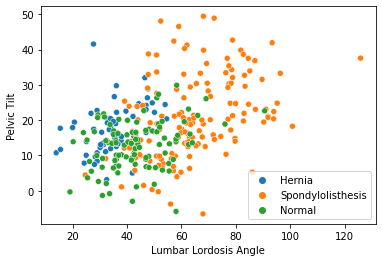
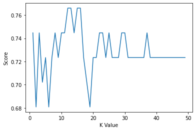
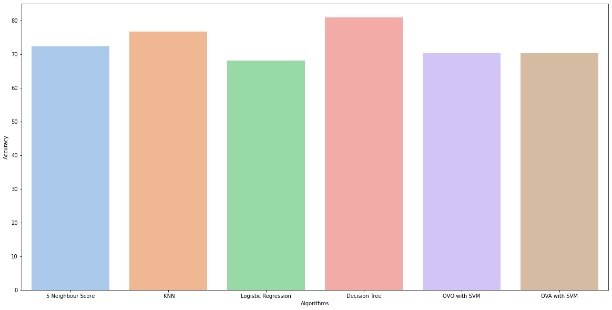

                                               Ahmet Fatih Çopur 17050111020
                                                
                Biomechanical features of orthopedic patients
                
Classifying patients based on six features (pelvic_tilt,sacral_slope etc.)

Categories: Normal (100 patients), Disk Hernia (60 patients) or Spondylolisthesis (150 patients).

"Spondylolisthesis" Class code is 2
"Normal" Class code is 1
"Hernia" Class code is 0


```python
import numpy as np
import pandas as pd
import seaborn as sns
import matplotlib.pyplot as plt


```


```python
data =pd.read_csv("column_3C_weka.csv")
data.head()
```


<div>
<style scoped>
    .dataframe tbody tr th:only-of-type {
        vertical-align: middle;
    }

    .dataframe tbody tr th {
        vertical-align: top;
    }

    .dataframe thead th {
        text-align: right;
    }
</style>
<table border="1" class="dataframe">
  <thead>
    <tr style="text-align: right;">
      <th></th>
      <th>pelvic_incidence</th>
      <th>pelvic_tilt</th>
      <th>lumbar_lordosis_angle</th>
      <th>sacral_slope</th>
      <th>pelvic_radius</th>
      <th>degree_spondylolisthesis</th>
      <th>class</th>
    </tr>
  </thead>
  <tbody>
    <tr>
      <th>0</th>
      <td>63.027817</td>
      <td>22.552586</td>
      <td>39.609117</td>
      <td>40.475232</td>
      <td>98.672917</td>
      <td>-0.254400</td>
      <td>Hernia</td>
    </tr>
    <tr>
      <th>1</th>
      <td>39.056951</td>
      <td>10.060991</td>
      <td>25.015378</td>
      <td>28.995960</td>
      <td>114.405425</td>
      <td>4.564259</td>
      <td>Hernia</td>
    </tr>
    <tr>
      <th>2</th>
      <td>68.832021</td>
      <td>22.218482</td>
      <td>50.092194</td>
      <td>46.613539</td>
      <td>105.985135</td>
      <td>-3.530317</td>
      <td>Hernia</td>
    </tr>
    <tr>
      <th>3</th>
      <td>69.297008</td>
      <td>24.652878</td>
      <td>44.311238</td>
      <td>44.644130</td>
      <td>101.868495</td>
      <td>11.211523</td>
      <td>Hernia</td>
    </tr>
    <tr>
      <th>4</th>
      <td>49.712859</td>
      <td>9.652075</td>
      <td>28.317406</td>
      <td>40.060784</td>
      <td>108.168725</td>
      <td>7.918501</td>
      <td>Hernia</td>
    </tr>
  </tbody>
</table>
</div>


```python
data.tail()
```


<div>
<style scoped>
    .dataframe tbody tr th:only-of-type {
        vertical-align: middle;
    }

    .dataframe tbody tr th {
        vertical-align: top;
    }

    .dataframe thead th {
        text-align: right;
    }
</style>
<table border="1" class="dataframe">
  <thead>
    <tr style="text-align: right;">
      <th></th>
      <th>pelvic_incidence</th>
      <th>pelvic_tilt</th>
      <th>lumbar_lordosis_angle</th>
      <th>sacral_slope</th>
      <th>pelvic_radius</th>
      <th>degree_spondylolisthesis</th>
      <th>class</th>
    </tr>
  </thead>
  <tbody>
    <tr>
      <th>305</th>
      <td>47.903565</td>
      <td>13.616688</td>
      <td>36.000000</td>
      <td>34.286877</td>
      <td>117.449062</td>
      <td>-4.245395</td>
      <td>Normal</td>
    </tr>
    <tr>
      <th>306</th>
      <td>53.936748</td>
      <td>20.721496</td>
      <td>29.220534</td>
      <td>33.215251</td>
      <td>114.365845</td>
      <td>-0.421010</td>
      <td>Normal</td>
    </tr>
    <tr>
      <th>307</th>
      <td>61.446597</td>
      <td>22.694968</td>
      <td>46.170347</td>
      <td>38.751628</td>
      <td>125.670725</td>
      <td>-2.707880</td>
      <td>Normal</td>
    </tr>
    <tr>
      <th>308</th>
      <td>45.252792</td>
      <td>8.693157</td>
      <td>41.583126</td>
      <td>36.559635</td>
      <td>118.545842</td>
      <td>0.214750</td>
      <td>Normal</td>
    </tr>
    <tr>
      <th>309</th>
      <td>33.841641</td>
      <td>5.073991</td>
      <td>36.641233</td>
      <td>28.767649</td>
      <td>123.945244</td>
      <td>-0.199249</td>
      <td>Normal</td>
    </tr>
  </tbody>
</table>
</div>


```python
sns.scatterplot(data=data, x="lumbar_lordosis_angle", y="pelvic_tilt", hue="class")
plt.xlabel("Lumbar Lordosis Angle")
plt.ylabel("Pelvic Tilt")
plt.legend()
plt.show()
```


    

    


```python
data["class"].value_counts()

```


    Spondylolisthesis    150
    Normal               100
    Hernia                60
    Name: class, dtype: int64


```python
data["class"]=[2 if (each == "Spondylolisthesis") 
               else 0 if (each =="Hernia") 
               else 1 for each in data ["class"]]
data.head(20)
```


<div>
<style scoped>
    .dataframe tbody tr th:only-of-type {
        vertical-align: middle;
    }

    .dataframe tbody tr th {
        vertical-align: top;
    }

    .dataframe thead th {
        text-align: right;
    }
</style>
<table border="1" class="dataframe">
  <thead>
    <tr style="text-align: right;">
      <th></th>
      <th>pelvic_incidence</th>
      <th>pelvic_tilt</th>
      <th>lumbar_lordosis_angle</th>
      <th>sacral_slope</th>
      <th>pelvic_radius</th>
      <th>degree_spondylolisthesis</th>
      <th>class</th>
    </tr>
  </thead>
  <tbody>
    <tr>
      <th>0</th>
      <td>63.027817</td>
      <td>22.552586</td>
      <td>39.609117</td>
      <td>40.475232</td>
      <td>98.672917</td>
      <td>-0.254400</td>
      <td>0</td>
    </tr>
    <tr>
      <th>1</th>
      <td>39.056951</td>
      <td>10.060991</td>
      <td>25.015378</td>
      <td>28.995960</td>
      <td>114.405425</td>
      <td>4.564259</td>
      <td>0</td>
    </tr>
    <tr>
      <th>2</th>
      <td>68.832021</td>
      <td>22.218482</td>
      <td>50.092194</td>
      <td>46.613539</td>
      <td>105.985135</td>
      <td>-3.530317</td>
      <td>0</td>
    </tr>
    <tr>
      <th>3</th>
      <td>69.297008</td>
      <td>24.652878</td>
      <td>44.311238</td>
      <td>44.644130</td>
      <td>101.868495</td>
      <td>11.211523</td>
      <td>0</td>
    </tr>
    <tr>
      <th>4</th>
      <td>49.712859</td>
      <td>9.652075</td>
      <td>28.317406</td>
      <td>40.060784</td>
      <td>108.168725</td>
      <td>7.918501</td>
      <td>0</td>
    </tr>
    <tr>
      <th>5</th>
      <td>40.250200</td>
      <td>13.921907</td>
      <td>25.124950</td>
      <td>26.328293</td>
      <td>130.327871</td>
      <td>2.230652</td>
      <td>0</td>
    </tr>
    <tr>
      <th>6</th>
      <td>53.432928</td>
      <td>15.864336</td>
      <td>37.165934</td>
      <td>37.568592</td>
      <td>120.567523</td>
      <td>5.988551</td>
      <td>0</td>
    </tr>
    <tr>
      <th>7</th>
      <td>45.366754</td>
      <td>10.755611</td>
      <td>29.038349</td>
      <td>34.611142</td>
      <td>117.270067</td>
      <td>-10.675871</td>
      <td>0</td>
    </tr>
    <tr>
      <th>8</th>
      <td>43.790190</td>
      <td>13.533753</td>
      <td>42.690814</td>
      <td>30.256437</td>
      <td>125.002893</td>
      <td>13.289018</td>
      <td>0</td>
    </tr>
    <tr>
      <th>9</th>
      <td>36.686353</td>
      <td>5.010884</td>
      <td>41.948751</td>
      <td>31.675469</td>
      <td>84.241415</td>
      <td>0.664437</td>
      <td>0</td>
    </tr>
    <tr>
      <th>10</th>
      <td>49.706610</td>
      <td>13.040974</td>
      <td>31.334500</td>
      <td>36.665635</td>
      <td>108.648265</td>
      <td>-7.825986</td>
      <td>0</td>
    </tr>
    <tr>
      <th>11</th>
      <td>31.232387</td>
      <td>17.715819</td>
      <td>15.500000</td>
      <td>13.516568</td>
      <td>120.055399</td>
      <td>0.499751</td>
      <td>0</td>
    </tr>
    <tr>
      <th>12</th>
      <td>48.915551</td>
      <td>19.964556</td>
      <td>40.263794</td>
      <td>28.950995</td>
      <td>119.321358</td>
      <td>8.028895</td>
      <td>0</td>
    </tr>
    <tr>
      <th>13</th>
      <td>53.572170</td>
      <td>20.460828</td>
      <td>33.100000</td>
      <td>33.111342</td>
      <td>110.966698</td>
      <td>7.044803</td>
      <td>0</td>
    </tr>
    <tr>
      <th>14</th>
      <td>57.300227</td>
      <td>24.188885</td>
      <td>47.000000</td>
      <td>33.111342</td>
      <td>116.806587</td>
      <td>5.766947</td>
      <td>0</td>
    </tr>
    <tr>
      <th>15</th>
      <td>44.318907</td>
      <td>12.537992</td>
      <td>36.098763</td>
      <td>31.780915</td>
      <td>124.115836</td>
      <td>5.415825</td>
      <td>0</td>
    </tr>
    <tr>
      <th>16</th>
      <td>63.834982</td>
      <td>20.362507</td>
      <td>54.552434</td>
      <td>43.472475</td>
      <td>112.309491</td>
      <td>-0.622527</td>
      <td>0</td>
    </tr>
    <tr>
      <th>17</th>
      <td>31.276012</td>
      <td>3.144669</td>
      <td>32.562996</td>
      <td>28.131342</td>
      <td>129.011418</td>
      <td>3.623020</td>
      <td>0</td>
    </tr>
    <tr>
      <th>18</th>
      <td>38.697912</td>
      <td>13.444749</td>
      <td>31.000000</td>
      <td>25.253163</td>
      <td>123.159251</td>
      <td>1.429186</td>
      <td>0</td>
    </tr>
    <tr>
      <th>19</th>
      <td>41.729963</td>
      <td>12.254074</td>
      <td>30.122586</td>
      <td>29.475889</td>
      <td>116.585706</td>
      <td>-1.244402</td>
      <td>0</td>
    </tr>
  </tbody>
</table>
</div>


```python
data.tail(20)
```


<div>
<style scoped>
    .dataframe tbody tr th:only-of-type {
        vertical-align: middle;
    }

    .dataframe tbody tr th {
        vertical-align: top;
    }

    .dataframe thead th {
        text-align: right;
    }
</style>
<table border="1" class="dataframe">
  <thead>
    <tr style="text-align: right;">
      <th></th>
      <th>pelvic_incidence</th>
      <th>pelvic_tilt</th>
      <th>lumbar_lordosis_angle</th>
      <th>sacral_slope</th>
      <th>pelvic_radius</th>
      <th>degree_spondylolisthesis</th>
      <th>class</th>
    </tr>
  </thead>
  <tbody>
    <tr>
      <th>290</th>
      <td>36.422485</td>
      <td>13.879424</td>
      <td>20.242562</td>
      <td>22.543061</td>
      <td>126.076861</td>
      <td>0.179717</td>
      <td>1</td>
    </tr>
    <tr>
      <th>291</th>
      <td>51.079833</td>
      <td>14.209935</td>
      <td>35.951229</td>
      <td>36.869898</td>
      <td>115.803711</td>
      <td>6.905090</td>
      <td>1</td>
    </tr>
    <tr>
      <th>292</th>
      <td>34.756738</td>
      <td>2.631740</td>
      <td>29.504381</td>
      <td>32.124998</td>
      <td>127.139849</td>
      <td>-0.460894</td>
      <td>1</td>
    </tr>
    <tr>
      <th>293</th>
      <td>48.902904</td>
      <td>5.587589</td>
      <td>55.500000</td>
      <td>43.315316</td>
      <td>137.108289</td>
      <td>19.854759</td>
      <td>1</td>
    </tr>
    <tr>
      <th>294</th>
      <td>46.236399</td>
      <td>10.062770</td>
      <td>37.000000</td>
      <td>36.173629</td>
      <td>128.063620</td>
      <td>-5.100053</td>
      <td>1</td>
    </tr>
    <tr>
      <th>295</th>
      <td>46.426366</td>
      <td>6.620795</td>
      <td>48.100000</td>
      <td>39.805571</td>
      <td>130.350096</td>
      <td>2.449382</td>
      <td>1</td>
    </tr>
    <tr>
      <th>296</th>
      <td>39.656902</td>
      <td>16.208839</td>
      <td>36.674857</td>
      <td>23.448063</td>
      <td>131.922009</td>
      <td>-4.968980</td>
      <td>1</td>
    </tr>
    <tr>
      <th>297</th>
      <td>45.575482</td>
      <td>18.759135</td>
      <td>33.774143</td>
      <td>26.816347</td>
      <td>116.797007</td>
      <td>3.131910</td>
      <td>1</td>
    </tr>
    <tr>
      <th>298</th>
      <td>66.507179</td>
      <td>20.897672</td>
      <td>31.727471</td>
      <td>45.609507</td>
      <td>128.902905</td>
      <td>1.517203</td>
      <td>1</td>
    </tr>
    <tr>
      <th>299</th>
      <td>82.905351</td>
      <td>29.894119</td>
      <td>58.250542</td>
      <td>53.011232</td>
      <td>110.708958</td>
      <td>6.079338</td>
      <td>1</td>
    </tr>
    <tr>
      <th>300</th>
      <td>50.676677</td>
      <td>6.461501</td>
      <td>35.000000</td>
      <td>44.215175</td>
      <td>116.587970</td>
      <td>-0.214711</td>
      <td>1</td>
    </tr>
    <tr>
      <th>301</th>
      <td>89.014875</td>
      <td>26.075981</td>
      <td>69.021259</td>
      <td>62.938894</td>
      <td>111.481075</td>
      <td>6.061508</td>
      <td>1</td>
    </tr>
    <tr>
      <th>302</th>
      <td>54.600316</td>
      <td>21.488974</td>
      <td>29.360216</td>
      <td>33.111342</td>
      <td>118.343321</td>
      <td>-1.471067</td>
      <td>1</td>
    </tr>
    <tr>
      <th>303</th>
      <td>34.382299</td>
      <td>2.062683</td>
      <td>32.390820</td>
      <td>32.319617</td>
      <td>128.300199</td>
      <td>-3.365516</td>
      <td>1</td>
    </tr>
    <tr>
      <th>304</th>
      <td>45.075450</td>
      <td>12.306951</td>
      <td>44.583177</td>
      <td>32.768499</td>
      <td>147.894637</td>
      <td>-8.941709</td>
      <td>1</td>
    </tr>
    <tr>
      <th>305</th>
      <td>47.903565</td>
      <td>13.616688</td>
      <td>36.000000</td>
      <td>34.286877</td>
      <td>117.449062</td>
      <td>-4.245395</td>
      <td>1</td>
    </tr>
    <tr>
      <th>306</th>
      <td>53.936748</td>
      <td>20.721496</td>
      <td>29.220534</td>
      <td>33.215251</td>
      <td>114.365845</td>
      <td>-0.421010</td>
      <td>1</td>
    </tr>
    <tr>
      <th>307</th>
      <td>61.446597</td>
      <td>22.694968</td>
      <td>46.170347</td>
      <td>38.751628</td>
      <td>125.670725</td>
      <td>-2.707880</td>
      <td>1</td>
    </tr>
    <tr>
      <th>308</th>
      <td>45.252792</td>
      <td>8.693157</td>
      <td>41.583126</td>
      <td>36.559635</td>
      <td>118.545842</td>
      <td>0.214750</td>
      <td>1</td>
    </tr>
    <tr>
      <th>309</th>
      <td>33.841641</td>
      <td>5.073991</td>
      <td>36.641233</td>
      <td>28.767649</td>
      <td>123.945244</td>
      <td>-0.199249</td>
      <td>1</td>
    </tr>
  </tbody>
</table>
</div>


```python
data["class"].values
```


    array([0, 0, 0, 0, 0, 0, 0, 0, 0, 0, 0, 0, 0, 0, 0, 0, 0, 0, 0, 0, 0, 0,
           0, 0, 0, 0, 0, 0, 0, 0, 0, 0, 0, 0, 0, 0, 0, 0, 0, 0, 0, 0, 0, 0,
           0, 0, 0, 0, 0, 0, 0, 0, 0, 0, 0, 0, 0, 0, 0, 0, 2, 2, 2, 2, 2, 2,
           2, 2, 2, 2, 2, 2, 2, 2, 2, 2, 2, 2, 2, 2, 2, 2, 2, 2, 2, 2, 2, 2,
           2, 2, 2, 2, 2, 2, 2, 2, 2, 2, 2, 2, 2, 2, 2, 2, 2, 2, 2, 2, 2, 2,
           2, 2, 2, 2, 2, 2, 2, 2, 2, 2, 2, 2, 2, 2, 2, 2, 2, 2, 2, 2, 2, 2,
           2, 2, 2, 2, 2, 2, 2, 2, 2, 2, 2, 2, 2, 2, 2, 2, 2, 2, 2, 2, 2, 2,
           2, 2, 2, 2, 2, 2, 2, 2, 2, 2, 2, 2, 2, 2, 2, 2, 2, 2, 2, 2, 2, 2,
           2, 2, 2, 2, 2, 2, 2, 2, 2, 2, 2, 2, 2, 2, 2, 2, 2, 2, 2, 2, 2, 2,
           2, 2, 2, 2, 2, 2, 2, 2, 2, 2, 2, 2, 1, 1, 1, 1, 1, 1, 1, 1, 1, 1,
           1, 1, 1, 1, 1, 1, 1, 1, 1, 1, 1, 1, 1, 1, 1, 1, 1, 1, 1, 1, 1, 1,
           1, 1, 1, 1, 1, 1, 1, 1, 1, 1, 1, 1, 1, 1, 1, 1, 1, 1, 1, 1, 1, 1,
           1, 1, 1, 1, 1, 1, 1, 1, 1, 1, 1, 1, 1, 1, 1, 1, 1, 1, 1, 1, 1, 1,
           1, 1, 1, 1, 1, 1, 1, 1, 1, 1, 1, 1, 1, 1, 1, 1, 1, 1, 1, 1, 1, 1,
           1, 1], dtype=int64)


```python
y = data["class"].values 
x_data = data.drop(["class"], axis=1) 
```


```python
x=(x_data-np.min(x_data))/(np.max(x_data)-np.min(x_data))
accuracies = {}

```


```python
from sklearn.model_selection import train_test_split
x_train,x_test,y_train,y_test=train_test_split(x,y,test_size=0.15,random_state=1)
```


```python
from sklearn.neighbors import KNeighborsClassifier
knn = KNeighborsClassifier(n_neighbors = 5)  
knn.fit(x_train, y_train)
prediction = knn.predict(x_test)
```


```python
acc = knn.score(x_test, y_test)*100
accuracies['5 Neighbour Score'] = acc
print("{} Neighbour Score: {:.2f}%".format(5, knn.score(x_test, y_test)*100))
```

    5 Neighbour Score: 72.34%
    


```python
score_list = []
for each in range(1,50):
    knn2 = KNeighborsClassifier(n_neighbors = each)
    knn2.fit(x_train, y_train)
    score_list.append(knn2.score(x_test,y_test))
    
plt.plot(range(1,50),score_list)
plt.xlabel("K Value")
plt.ylabel("Score")
plt.show()
```


    

    


```python
acc = max(score_list)*100
accuracies[' KNN'] = acc
print("Maximum KNN Score is {:.2f}%".format(acc))
```

    Maximum KNN Score is 76.60%
    


```python
from sklearn.linear_model import LogisticRegression
lr = LogisticRegression()
lr.fit(x_train,y_train)
acc = lr.score(x_test,y_test)*100
accuracies['Logistic Regression'] = acc
print("Test Accuracy : {:.2f}%".format(acc))
```

    Test Accuracy : 68.09%
    


```python
from sklearn.tree import DecisionTreeClassifier
dt = DecisionTreeClassifier()
dt.fit(x_train,y_train)

acc = dt.score(x_test,y_test)*100
accuracies['Decision Tree'] = acc
print("Test Accuracy : {:.2f}%".format(acc))
```

    Test Accuracy : 80.85%
    


```python
from sklearn.svm import SVC
from sklearn.multiclass import OneVsRestClassifier


ovo = OneVsRestClassifier(SVC(kernel='linear', decision_function_shape='ovo'))
ovo.fit(x_train,y_train)

acc = ovo.score(x_test,y_test)*100
accuracies['OVO with SVM'] = acc
print("Test Accuracy : {:.2f}%".format(acc))
```

    Test Accuracy : 70.21%
    


```python
ova = OneVsRestClassifier(SVC(kernel='linear', decision_function_shape='ovr'))
ova.fit(x_train,y_train)
acc = ova.score(x_test,y_test)*100
accuracies['OVA with SVM'] = acc
print("Test Accuracy : {:.2f}%".format(acc))
```

    Test Accuracy : 70.21%
    


```python
plt.figure(figsize=(20,10))
plt.yticks(np.arange(0,100,10))
plt.ylabel("Accuracy")
plt.xlabel("Algorithms")
sns.barplot(x=list(accuracies.keys()), y=list(accuracies.values()), palette="pastel")
plt.show()

```


    

    


In this project, first of all I decided to convert disease types to number 
for calculating scores easily. After that, I normalized the data then created the train test split. Secondly, I created classifications. In the knn classification 5 neighbours accuracy score is 72.34% it may be not best so, I created best KNN score algorithm then it is 76.60%. After that I created the other classifications and put the accuracy scores on to accuracies{}. Then I compared the accuracy score which is best. "DECISION TREE" is the best accuracy for my dataset. 
